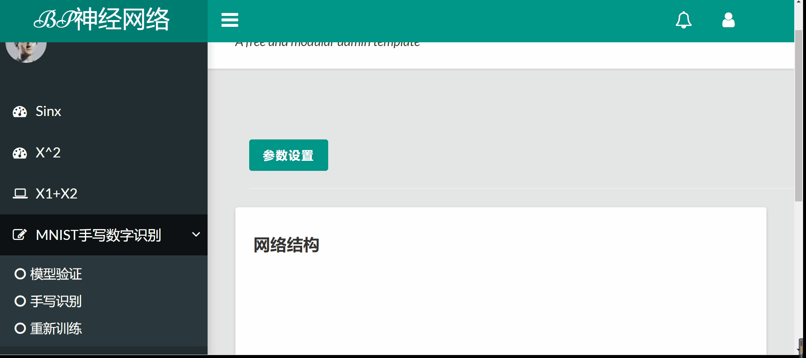
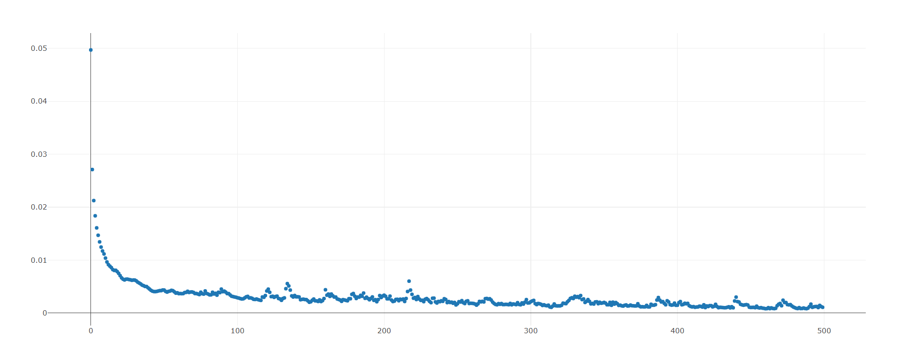
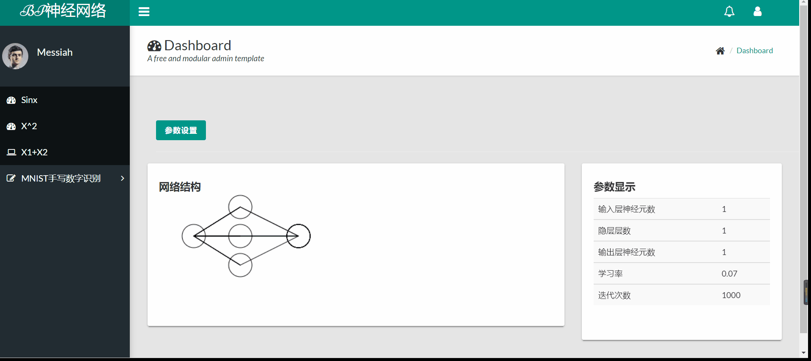
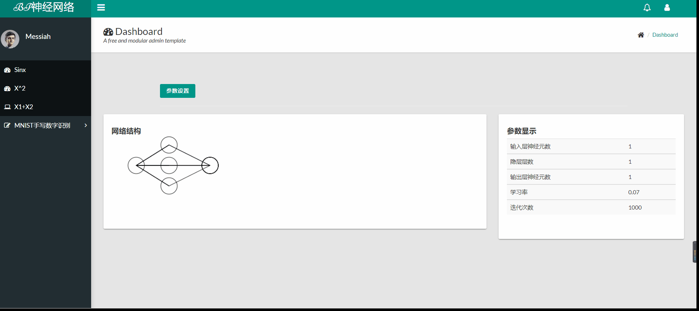
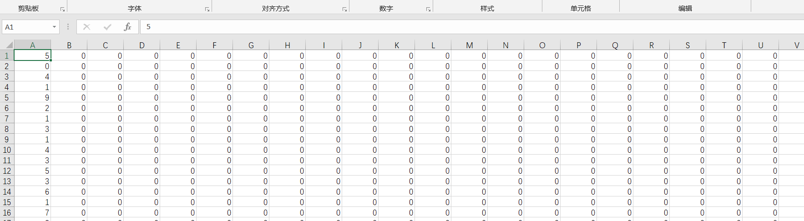

# BP神经网络
> Author: Xian He

> Email:  13340077150@163.com

> Description: 纯numpy实现BP神经网络，实现了全连接层，MSELoss，Sigmoid，relu激活函数，拟合sin，cos，x+y三种函数。并且利用BP神经网络实现了mnist手写数字识别，搭配前端提供画笔，动态识别。

## mnist手写数字识别效果展示
利用训练好的BP神经网络进行手写数字识别

### 模型验证
用验证集图片验证训练好的BP神经网络模型


### 手写数字识别

前端用JS生成画板供用户进行书写


### 训练LOSS展示

下图展示了训练时的loss下降图



## BP神经网络拟合函数效果展示

### 定义网络结构并显示


### 拟合sinx

训练并且拟合(-3.14，3.14)范围内的sin函数



### 拟合cosx

训练并且拟合(-3.14，3.14)范围内的cos函数



### 拟合X1+X2曲面

训练并且拟合形如X1+X2的曲面,需要改变输入神经元为2个


## 代码解析

mnist训练

### 训练集和测试集

分别是csv格式的手写数字，大小为28*28，每列第一个为该行的标识



### 网络结构

784个输入神经元代表着28*28大小的图片，输出10个神经元，代表0-9的数字，
隐层200个神经元，学习率为0.1
```
class neuralNetwork:
    def __init__(self, inputnodes=784, hiddennodes=200, outputnodes=10, learningrate=0.1):
        self.inodes = inputnodes
        self.hnodes = hiddennodes
        self.onodes = outputnodes

        self.lr = learningrate
        self.wih = (numpy.random.normal(0.0, pow(self.hnodes, -0.5), (self.hnodes, self.inodes)))
        self.who = (numpy.random.normal(0.0, pow(self.onodes, -0.5), (self.onodes, self.hnodes)))
```

### 训练过程

正向计算，误差反向传播，实现MSE计算误差，并且反向更新权值

```
    def train(self, inputs_list, targets_list):
        inputs = numpy.array(inputs_list, ndmin=2).T
        targets = numpy.array(targets_list, ndmin=2).T
        hidden_inputs = numpy.dot(self.wih, inputs)
        hidden_outputs = self.activation_function(hidden_inputs)
        final_inputs = numpy.dot(self.who, hidden_outputs)
        final_outputs = self.activation_function(final_inputs)
        output_errors = targets - final_outputs
        hidden_errors = numpy.dot(self.who.T, output_errors)

        self.who += self.lr * numpy.dot((output_errors * final_outputs * (1.0 - final_outputs)),
                                        numpy.transpose(hidden_outputs))
        self.wih += self.lr * numpy.dot((hidden_errors * hidden_outputs * (1.0 - hidden_outputs)),
                                        numpy.transpose(inputs))
        Etotal = 0.5 * (numpy.sum((output_errors) ** 2))
        return Etotal
```

### 测试过程

将测试集输入，一次正向传播的输出结果中最大的那一项就是预测结果

```
    def query(self, inputs_list):
        inputs = numpy.array(inputs_list, ndmin=2).T
        hidden_inputs = numpy.dot(self.wih, inputs)
        hidden_outputs = self.activation_function(hidden_inputs)
        final_inputs=numpy.dot(self.who,hidden_outputs)
        final_outputs = self.activation_function(final_inputs)
        return final_outputs
```
```
    def test(self,item):
        our_own_dataset = self.Init()
        inputs = our_own_dataset[item][1:]
        outputs = self.query(inputs)
        label = numpy.argmax(outputs)

        return str(label)
```

## numpy实现BP神经网络

### 网络结构

网络结构可以自定义，只要改变传入形参即可

```
class ANN:
    def __init__(self, layer, sample_in, sample_out, lrates, cycles):
        self.sample_in = np.array(sample_in)
        self.sample_out = np.array(sample_out)
        self.in_sample = ""
        self.out_sample = ""
        self.cycles = cycles
        self.layer = layer
        self.lrates = lrates
        self.num_layers = len(layer)
        print(layer)
        print("ss")
        self.biases = [np.random.randn(y, 1) for y in layer[1:]]
        print("ss")
        self.neu = []
        self.weights = [np.random.randn(x, y) for x, y in
                        zip(self.layer[:-1], self.layer[1:])]
        for i in range(0, len(self.weights)):
            self.weights[i] = self.weights[i].T
```

### 三种激活函数及其导数

```
def sigmoid(x):
    return 1 / (1 + np.exp(-x))

def tanh(x):
    return (np.exp(x) - np.exp(-x)) / (np.exp(x) + np.exp(-x))

def relu(x):
    # print(x)
    M=[]
    for i in x:
        if(i[0]<0):
            M.append([0.0])
        else:
            M.append(i)
    M=np.array(M)
    # print(M)
    return M
def derivatesig(x):
    return x*(1-x)
def derivatetanh(x):
    return 1-x*x
def derivaterelu(x):
    M=[]
    # print(x)
    for i in x:
        if(i[0]<0):
            M.append([0])
        else:
            M.append([1])
    M=np.array(M)
    return M
```

### 前向传播

```
    def forwar(self, index):
        label = 0
        Data = ''
        for i in range(0, len(self.layer) - 1):
            if (label == 0):
                Data = np.array(self.sample_in[index])

                Data = np.dot(self.weights[i], Data)

                Data = Data + self.biases[i]

                Data = ActivateFuc.sigmoid(Data)  # Sigmoid function

                self.neu.append(Data)
                label = 1
            else:
                if (i != (len(self.layer) - 2)):
                    Data = np.dot(self.weights[i], Data)

                    Data = Data + self.biases[i]
                    Data = ActivateFuc.sigmoid(Data)  # Sigmoid function
                else:
                    Data = np.dot(self.weights[i], Data)
                    Data = Data + self.biases[i]
                self.neu.append(Data)

        return Data

```

### 后向传播

一次性更新所有参数

```
    def backwar(self, index):
        deltaw = []
        d = []
        label = 0

        for i in range(len(self.neu) - 1, -1, -1):

            if label == 0:

                d.append(self.neu[i] - self.sample_out[index])

                label = 1
            else:

                d.append(ActivateFuc.derivatesig(self.neu[i]) * np.dot(self.weights[i + 1].T, d[-1]))

        for i in range(0, len(self.weights)):
            if (i == 0):
                self.weights[i] = self.weights[i] - self.lrates * (
                    np.dot(d[len(d) - 1 - i], np.array(self.sample_in[index]).T))
                self.biases[i] = self.biases[i] - self.lrates * d[len(d) - 1 - i]
            else:
                self.weights[i] = self.weights[i] - self.lrates * (
                    np.dot(d[len(d) - 1 - i], self.neu[i - 1].T))
                self.biases[i] = self.biases[i] - self.lrates * d[len(d) - 1 - i]

```


